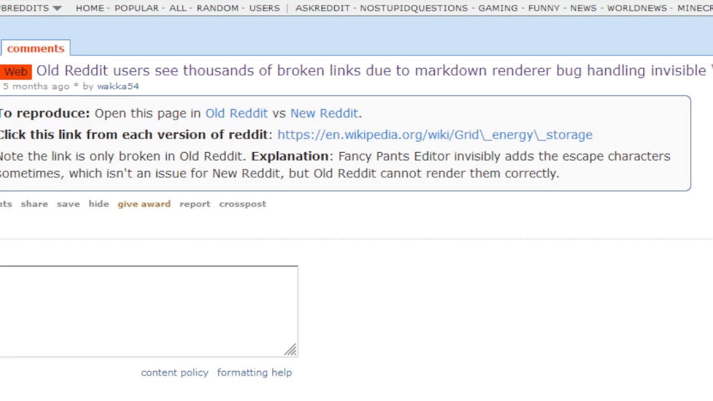

## Old Reddit Broken Link Fixer

### [GitHub](https://github.com/whqwert/userscripts/raw/main/scripts/Old-Reddit-Link-Fixer.user.js) | [Greasy Fork](https://greasyfork.org/en/scripts/435825-old-reddit-broken-link-fixer)

Fixes incorrectly escaped characters in links on Old Reddit

## eBay Sponsored Listings Hider

### [GitHub](https://github.com/whqwert/userscripts/raw/main/scripts/EBay-Sponsored-Listings-Hider.user.js) | [Greasy Fork](https://greasyfork.org/en/scripts/483814-ebay-sponsored-listings-hider)

Hides sponsored listings on eBay

## Truffle.TV Auto-Claimer

### [GitHub](https://github.com/whqwert/userscripts/raw/main/scripts/Truffle-Auto-Claim.user.js) | [Greasy Fork](https://greasyfork.org/en/scripts/455125-truffle-tv-auto-claimer)

Auto-claim Truffle.TV channel points

# Archived scripts

## Bandcamp Downloader

### [GitHub](https://github.com/whqwert/userscripts/raw/main/scripts/Bandcamp-Downloader.user.js) | [Greasy Fork](https://greasyfork.org/en/scripts/435824-bandcamp-downloader)

Adds buttons to download mp3 files from Bandcamp
